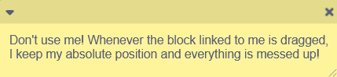
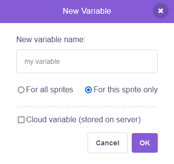

# Best practices when writing scratch code
*scratchtomv*

* Avoid using scratch comments.  

* Find appropriate variable names.  
* Avoid using temporary variables, it will create conflicts at some points although they can be useful for reducing the amount of variables.  
* Use functions instead of spaghetti code (but don’t overuse).  
* Use functions with “Run without screen refresh” when possible, instead of using turbo mode (except when the function has a very large loop).

* Don’t use clones for resource-intensive computation. In 3D programming we will almost never use them.  
* Try to avoid most built-in scratch functions. You should really be working with variables, lists and operators exclusively.  
* Use local variables when you can instead of global ones.  

* Clean and organize your code. *Be careful with the clean up blocks function, as it can move blocks to places which may not be ideal for some*
* Don’t use one big sprite for all your code, it will slow down your project when in editor \[i’m devastated \- bozzle\] \[same \- jfs22\] \[heartbraking \- spog\] \[died of sad \- derpy\] \[literally crying rn \- spinning\] \[ain’t no way- AJ\]\[lol \- scratchtomv\] \[i refuse to accept this \- 3TheHedgehogCoder3\]\[I used to think broadcasts were slow, but I had to noooo \- rinostar\]