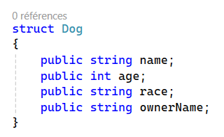
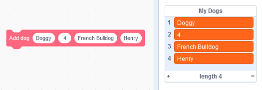

# Object representation in Scratch

*scratchtomv*  
In Scratch, the basic way of storing data is by using variables, which can contain one information at a time. But how to store multiple pieces of information related to one object?

Let’s take the example of a dog : we need dog objects with multiple information related to it, like his name, his age, his race, his owner, etc.  
Would look like this in C\# : 



It can also be represented as a table : 

| Data index | Property name |
| :---- | :---- |
| 1 | Name (string) |
| 2 | Age (int) |
| 3 | Race (string) |
| 4 | Owner Name (string) |

This object needs 4 data slots to be stored.

### Storing objects in lists {#storing-objects-in-lists}

*scratchtomv*  
We just saw how to create one object, but what about handling *thousands* of theses ? Meshes can contain thousands of faces and vertices, we can’t hold all this data in a few variables, we need to use lists.   
Lists in scratch are indexed by an integer starting from 1 (unlike most programming languages which start from zero), and each item in a list can hold values of any type Scratch variables can.   
To store objects in a list, we need to partition it. There are multiple ways of partitioning a list, which we’ll see in the next parts.

### Constant and defined object size {#constant-and-defined-object-size}

*scratchtomv*  
If the objects stored in the list **always** take an **n-amount** of data slots, the list can be divided into groups of n-slots. It’s the most efficient and the most common way of storing objects.

| Index | Data | Object representation |
| :---- | :---- | ----- |
| 1 | Property A | Object 1 |
| 2 | Property B |  |
| 3 | Property A | Object 2 |
| 4 | Property B |  |
| 5 | Property A | Object 3 |
| 6 | Property B |  |

This simple scratch function create a dog (works for any kind of objects) :   

```blocks
define Add dog (name) (age) (race) (owner)
    add (name) to [my dogs v]
    add (age) to [my dogs v]
    add (race) to [my dogs v]
    add (owner) to [my dogs v]
```

…And is used like that  



The object data can be accessed with two methods :   
This is the fastest way, but you need to increment the dog index by 4 when looping through the list of dogs :   

```blocks
(item ((put your dog index here) + (put your data index here)) of [my dogs v])
```

This way is a bit slower and uses one more block, but is more straightforward :   

```blocks
(item (((put your dog index here) * (4)) + (put your data index here)) of [my dogs v])
```

This example accesses the age of the dog \#0, and returns the second item for this dog, in this case 4 :   

```blocks
(item ((0) + (2)) of [my dogs v])
```

### Constant but undefined object size using a list of pointers {#constant-but-undefined-object-size-using-a-list-of-pointers}

*scratchtomv*  
If the objects stored in the list can take **any amount** of data slots, the list *can’t* be divided into groups of constant n-slots. Thus, to be able to access its data correctly we need the use of another list containing pointers to the list containing the objects. This concept is used in a variety of situations.

| Index | Data | Object representation |
| :---- | :---- | ----- |
| 1 | Property A | Object 1 |
| 2 | Property B |  |
| 3 | Property C |  |
| 4 | Property A | Object 2 |
| 5 | Property A | Object 3 |
| 6 | Property B |  |

<div style="text-align: center;">⇕ Linked lists ⇕</div>

| Index | Data |
| :---- | :---- |
| 1 | 1  \=\> (Pointer to object 1\) |
| 2 | 4  \=\> (Pointer to object 2\) |
| 3 | 5  \=\> (Pointer to object 3\) |

### Dynamic object size {#dynamic-object-size}

*scratchtomv*  
Dynamic object allocating is really **slow** and you should avoid it by using other storing methods, such as pre-allocating enough data slots.

But if you really need to be able to grow or shrink an object size, you can achieve it by using linked lists : 

* When an object A needs to **grow** in size, use the “insert” block to insert a new data slot, then loop through all the pointer’s list and increase by 1 all pointers higher than the object A index.[^1]   
* When an object B needs to **shrink** in size, do the same as the growing operation but with the “remove at” block to remove the desired data slot, and decrease by 1 the pointers.