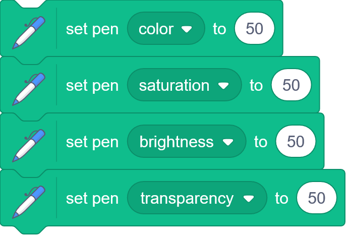

# Color representation in Scratch
*scratchtomv*  

In 3D computing, colors are often represented as a set of 3 values: Red, Green and Blue. There’s sometimes also a fourth one: Alpha (abbreviated as A), often used for transparency.  
When rendering a 3D scene, these values can be easily modified to change the final color of the object. This is done through setting a [Material](../shading/shading.md#material) color, [Shading](../shading/shading.md) and [Post-processing](./post-processing.md).

However, Scratch doesn’t natively support RGB colors, you need to convert to a supported color format, such as : 

* Hexadecimal (ex: \#FF2D55)  
* Decimal (ex: 16711680\)

The pen color can be set with this block :   

Or with the combination of these blocks (uses the HSVA model, and is slower) :   

