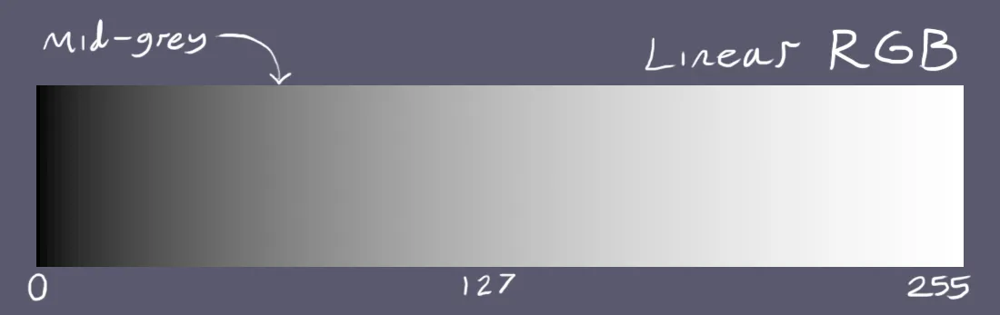
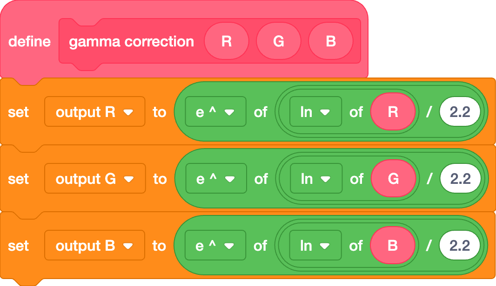
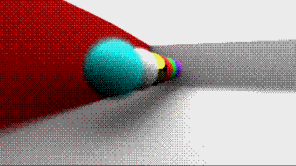

# Post-processing
*jfs22,badatcode123,26243AJ*

Post processing algorithms modify screen colors after all other effects, directly before rendering. These algorithms include tonemappers, gamma correction, color grading, and other color processing effects.

### Tonemapping

Tonemappers can change the tone of the image, since it directly affects the colors. Tonemappers are also used to increase the white point/remove it all together (the white point is when a color that is too bright turns white because of clamping). A few popular tonemappers used in scratch can be found below.  
[https://www.desmos.com/calculator/fzixe9wazx](https://www.desmos.com/calculator/fzixe9wazx)

### Gamma correction

Contrary to linear representations of colors, such as RGB, the human eye perceives brightness in a non-linear way. Our eyes are much more sensitive to changes in dark colors, and less sensitive to changes in bright colors.Thus, if we attempt to display a linear spectrum, to our eyes it will appear non-linear.   

To combat this, most modern displays apply a gamma function to the input rgb colors, creating a more balanced spectrum. (commonly referred to as sRGB)  

Although this is great news for our eyes, lighting calculations in 3d graphics utilize linear RGB. Thus, when we sample an sRGB color/texture, we first need to convert it to RGB. This can be done by raising the color values to the power of 2.2. Likewise, when we display the RGB values, we need to revert them to sRGB by raising them to the power of 1/2.2. *(by 26243AJ)*  
Note that this is only an approximation, the full conversion can be found below  
[https://www.desmos.com/calculator/5kppnk4gkx](https://www.desmos.com/calculator/5kppnk4gkx) (*by spinningcube*)  
Using the exponent workaround, we can apply the *x*1/2.2 adjustment on Scratch:

### Color grading

Like other post processing effects, color grading changes the colors of an image, although it is usually done artistically, and for no physical reasons. One example of color grading is posterization or quantization, this stylization method lowers the range of colors that are displayed. 

This effect is sometimes used with dithering to trick your eyes into thinking there is more color ranges in the images   

