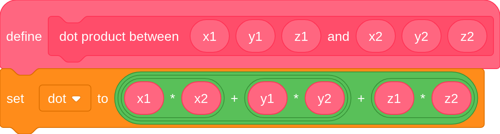
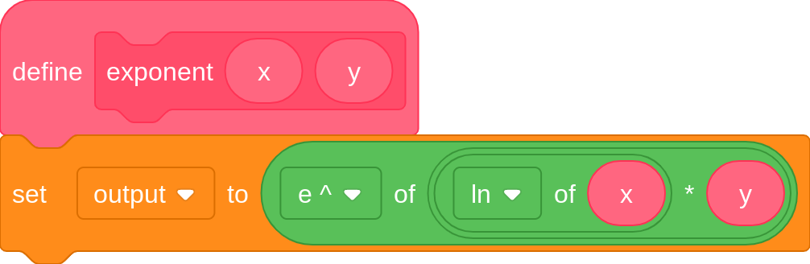
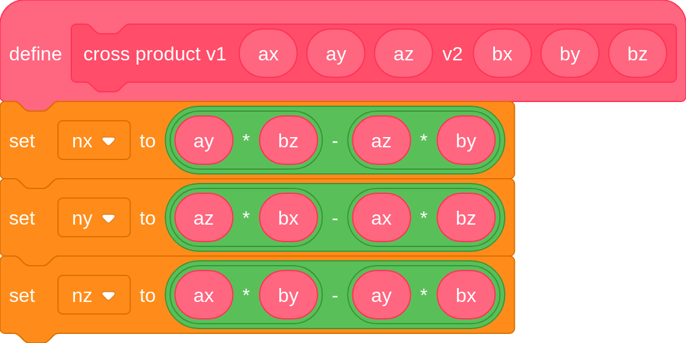
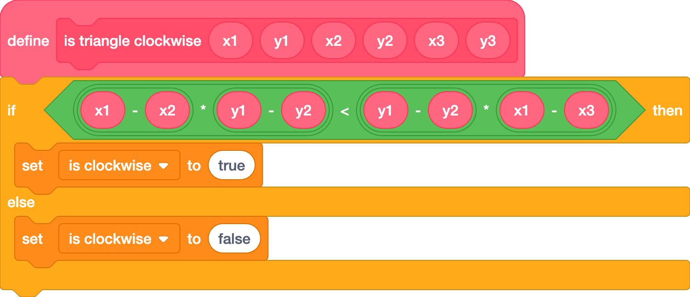
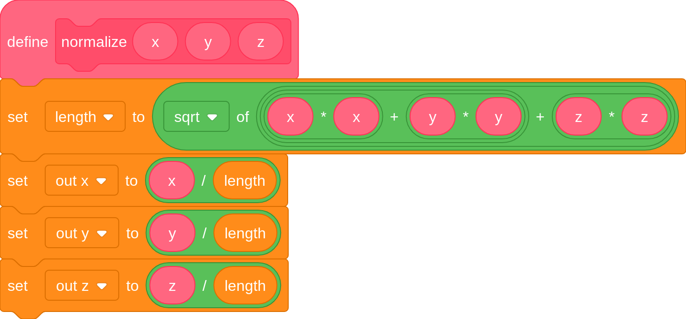
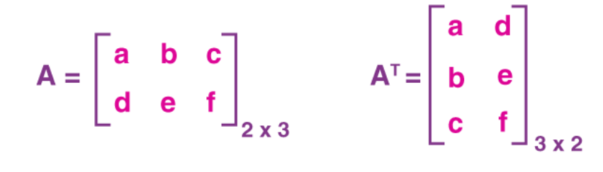

# Math functions
\=\> porting most of the functions from   
[https://www.khronos.org/opengles/sdk/docs/manglsl/docbook4/](https://www.khronos.org/opengles/sdk/docs/manglsl/docbook4/)

Scratch doesn’t include a lot of useful mathematical or vector manipulation functions like in other programming languages. Here is a useful list of common math functions written in Scratch code : 

**Dot product:** tells how alike 2 vectors are, if they are the same length. 1 means they are the same vector and \-1 means they are the exact opposites, and 0 means they are perpendicular to each other.  

**Exponents:** repeatedly multiplies x by itself y times.  

**Cross product:** gives a vector perpendicular to the 2 vectors inputted.

**Test if triangle is ordered clockwise :** (useful for backface culling)  

**Normalize:** sets a vector’s magnitude to 1, while retaining its direction.  

**Transpose**: Rotating the matrix format (For inverse TBN since inverse is expensive and they do the same thing in that case.)  

# 