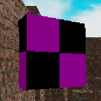
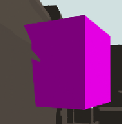
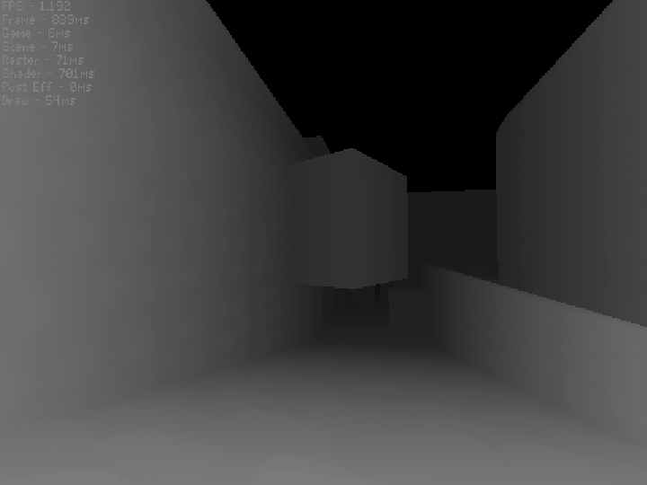

# Depth Buffers
*(urlocalcreator)*  

In rendering using the scanline technique, using a depth buffer may be preferred rather than sorting triangles one by one. Using a depth buffer is fast, but at the consequence of forcing the scanline technique rather than a faster incircle filler.

In a situation in which you need a Z buffer, you can simply go along with the scanline technique and interpolate between the Z value for the edges of which you are rendering, then for every pixel, you save the Z value in a list if the Z value for that pixel is less than the one saved for the pixel from the previous triangles. It allows for you to have objects clip into each other as a benefit, and reduces strain on the CPU from sorting. There is no real consequence to having a Z buffer unless you want to use a faster rendering approach.

2 Images from the same engine but different rendering techniques

As you can see, rendering with a depth buffer can get rid of the triangles that should not be seen.

Another way you can see the depth buffer is in a shaded gray image. It resembles how far something is from the camera in the Z direction and can be called a depth map. A depth map allows you to do some cool shading effects later on in local space (which may be discussed in a later chapter).  

