# Path-tracing
*badatcode123,bambozzle*  

Path-tracing, a subset of raytracing, is a way to make highly realistic images. Path-tracing emulates how rays of light behave in the real world, to give more realistic results than other techniques at the cost of performance. In the real world, rays of light are emitted from light sources, and bounce around the world until they hit your eyes. As the light ray bounces off objects, some of the frequencies of light in it get absorbed, tinting the light. In path-tracing, the rays are shot from the camera and reflect around the scene until it hits a light source. This is because simulating rays from the light is wasteful, as most of these rays will not end up at the camera, and so will not affect the final image, but when the rays are shot from the camera, all rays are relevant to the final image. This is still accurate as light behaves the same whether it is moving forwards or backwards in time[^6]. 

  Now to implement pathtracing, we first need to get the surface normal. The surface normal of an object can be outputted by the intersection function itself. Then we need an emissive color for the lights. We need 6 new variables, named ray throughput r,g,b and ray emissive r,g,b. The ray emissive variables will be the final color of the pixels, while the ray throughput variables will be to store the colors of the objects the ray has encountered so far (for indirect illumination). So, for each object, define its emissive color, and make 6 new variables to store these properties (including the surface normal). Now, after each intersection we do this

1. Change the ray emissive color by throughput\*object emissive color  
1. Set the throughput to throughput\*object color

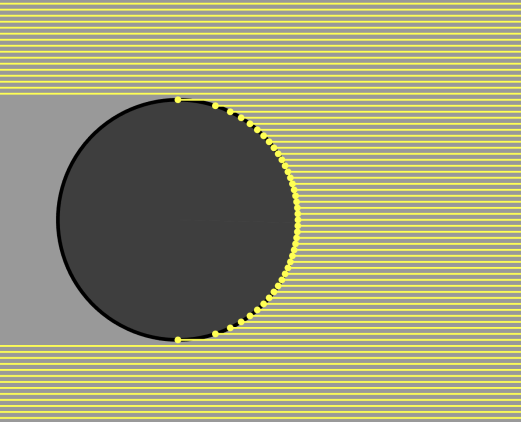

Make sure to set all the color channels in the throughput to 1 and the emissive’s to 0 before shooting the ray from the camera. We should also add a `is light?` boolean to the intersections to determine when objects are light sources and we can stop tracing the ray. We should also multiply the throughput by the dot product between the outgoing direction and the normal vector (see the math section), this is because light is more spread out at steep angles so there is less light hitting a particular point overall, this effect can be shown with the below image, we do the dot product with the outgoing direction rather than the incoming direction because we are doing the light calculations in reverse. 
Here’s the code for the normal of a sphere and how to use it.  

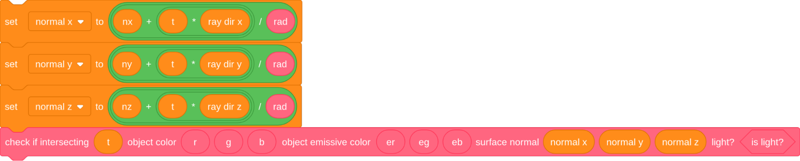

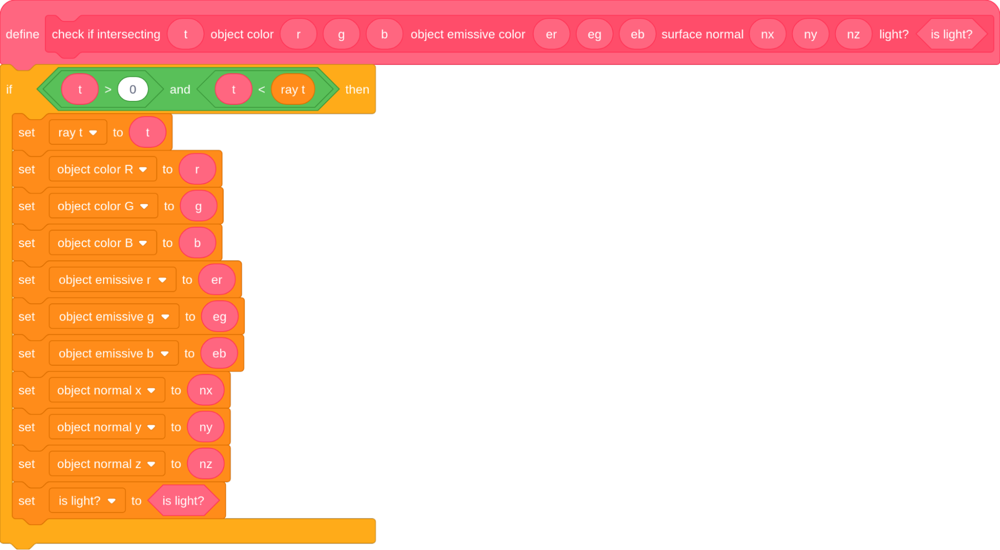

With the surface normal we can make a simple diffuse sphere.  Diffuse means that the outgoing ray direction is completely random, so we need to be able to generate a random unit vector, then check that this random vector is in the correct orientation (facing the same side as the normal), to do this, take the dot product between the normal and the random vector, if it is less than 0, we invert the random vector. We can then set it as the ray direction. We then shoot the ray again, but from the intersection point and the new ray direction. Make sure to move the ray to the intersection point *before* generating the new outgoing direction.  

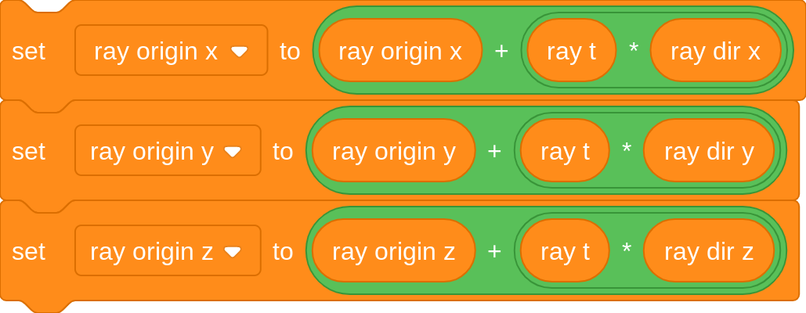

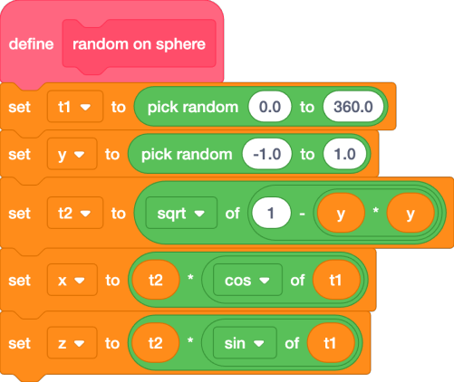

*From SpinningCube*

Now we can make a loop that represents the ray bounces, how many times it repeats is the amount of bounces around the scene the ray does. Defining a scene custom block can make it easier to edit and make the scene.  
The ray bounces loop then looks like this:  

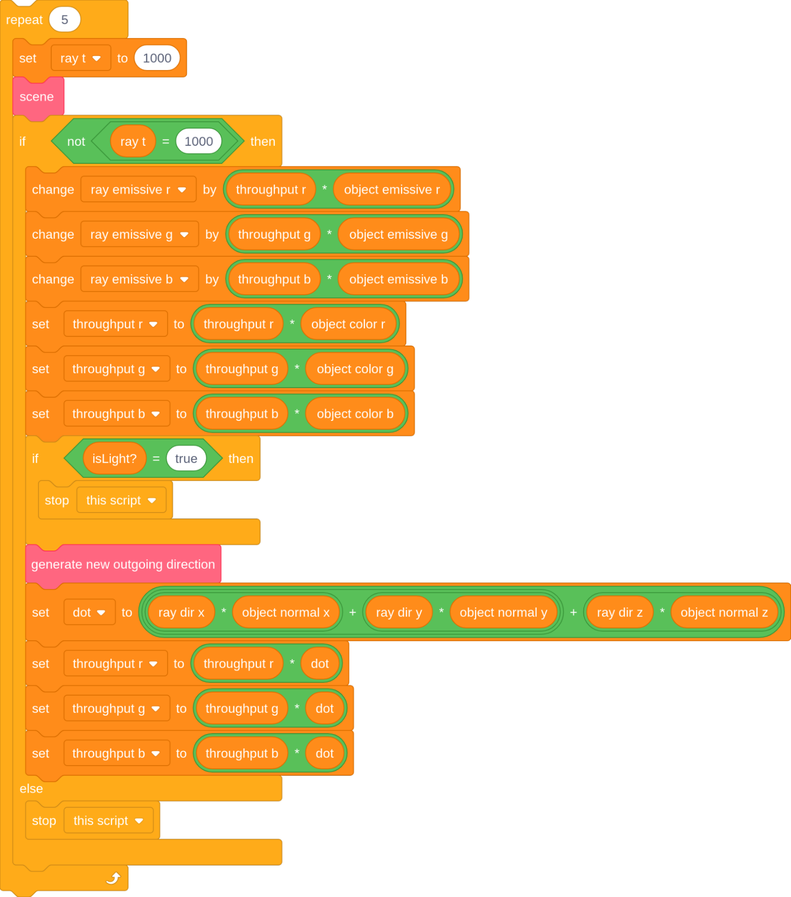

Now when rendering, it should look like this  

However, this image is very noisy. This is because we are only sending one ray per pixel (1 sample), when we really should be trying to send as many as possible. There are 2 ways to do more samples, store the render in a buffer and keep rendering the scene and averaging the colors in the buffer and the colors in the render, or do all the samples at once using a repeat block, adding up the colors of the different samples and dividing by the amount of samples we took. We will be doing the second method since it is easier.  

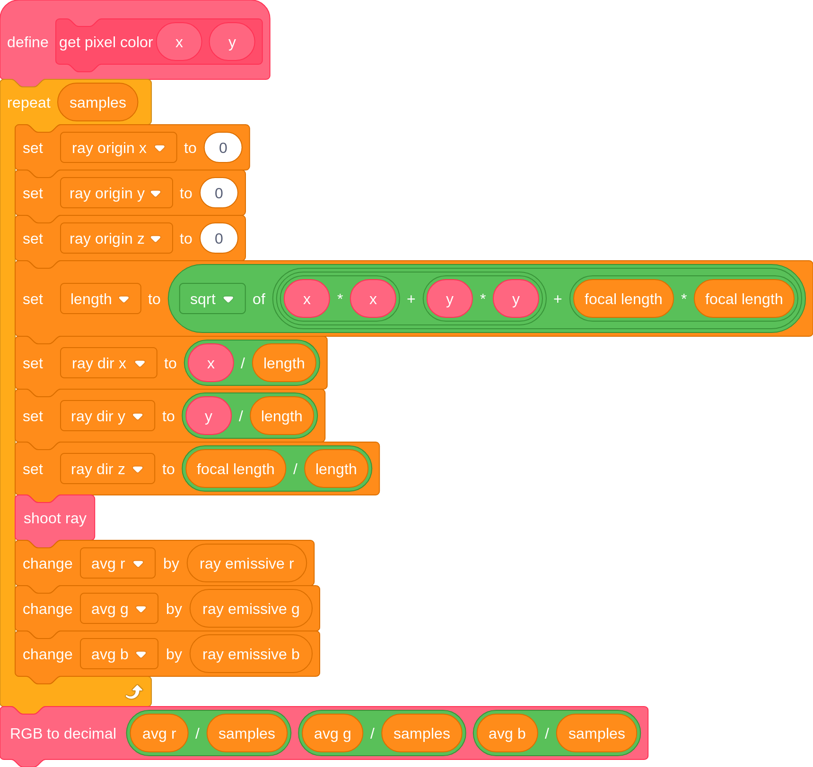

Now we can easily decrease the noisiness of the image by increasing the sample count, at the cost of speed. Here is the same scene from before but with 20 samples  

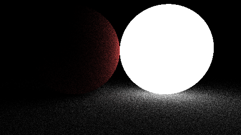

As you can see, the noise has decreased significantly and will decrease even more as the sample count is increased. But it takes quite a long time for the output to converge to an image that doesn’t have visible noise, to fix this we need to improve the way we are shooting out rays from the objects. In order to do this, we should first look at the rendering equation.

### The rendering equation

The rendering equation is the equation all pathtracers try to approximate. And it looks like this:  

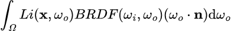

While this might look intimidating, it is actually surprisingly easy. The integral with the Ω symbol is telling us to integrate over a hemisphere of all possible outgoing ray directions, so we can ignore the integral symbol and the dωo. Now let’s define the variables, the **x** variable represents a position in space, ωo represents the outgoing direction of a ray while ωi represents the incoming direction. The Li() function tells you the amount of light from **x** in some direction ωo, this function itself uses the rendering integral, which is why the rendering equation is recursive. The BRDF() stands for bidirectional reflectance distribution function, it essentially tells you the amount of rays going out in some direction based on the incoming direction. Here is a representation of the lambertian/diffuse BRDF  

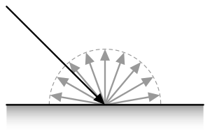

It is just a hemisphere because every direction has an equal chance to be picked. This is the specular BRDF  

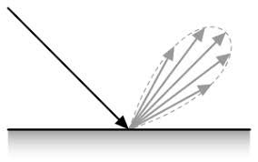

As you can see, it more light reflects specularly

The BRDF of diffuse materials is simply albedo/π, albedo means the amount of light reflected off of a surface. An albedo of 1 means the surface reflects all light that hits it and an albedo of 0.5 means the surface will absorb half the light and reflect the other half. Since we are always reflecting the light, we should be diving the throughput by π, but since we aren’t, we are implicitly saying that the albedo is π, which is wrong because no surface should reflect more light than the light it hits, to correct for this we must divide the throughput by π. The final term, (ωo\***n**) is just the dot product between the outgoing ray direction and the surface normal, and we are already multiplying the throughput by this. 

  Obviously, we cannot sample every direction in a hemisphere since there is an infinite amount of directions to sample, so to solve the rendering equation, a technique called Monte Carlo integration is used. A Monte Carlo algorithm samples a function at random values and averages these samples to approximate the true answer to an integral. Some integrals (such as the rendering equation) require many samples to converge, but given enough samples a Monte Carlo algorithm ALWAYS converges. However, there are ways to help the algorithm converge faster, one such method is called importance sampling.

### Importance sampling

Importance sampling is a method that samples the most important part of an integrand and downsamples (makes it contribute less by multiplying the output by a small number) the samples to correct for the bias. For example take the function below  

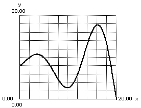

To importance sample this, we would sample more around the peaks and sample less around the valleys. There are many different areas we could importance sample in a pathtracer, however we will be looking at the easiest one for now. The multiplication of the throughput by the dot product between the surface normal and the outgoing ray direction can be worrisome because if the outgoing direction is almost perpendicular to the normal, the throughput will be multiplied by a very small number and the work of the ray will be essentially wasted, meanwhile if the direction is very similar to the normal the throughput will be multiplied by a number close to 1, if we could find a way to sample directions closer to the normal more often and perpendicular to it less often, we wouldn’t waste as much rays. This actually ends up being very simple to do, after generating a random direction, simply add the surface normal to it and then normalize the vector, now we can then remove dot product multiplication. However, this would actually double the brightness of all objects, thus we need to divide the throughput by 2, you could also just divide by tau instead of having to divide by pi then divide by 2\.

  After implementing this, our pathtracer immediately sees a jump in quality  

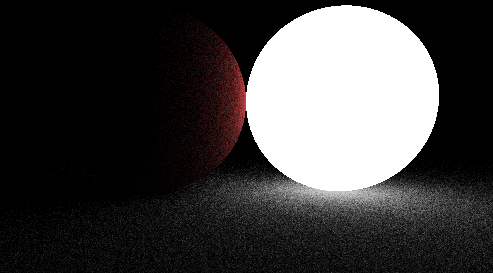

*(same scene and sample count as before, but with a brighter light source)*  
We aren’t downsampling by much more because it turns out that biasing the outgoing direction this way *almost* perfectly cancels out the dot product. We won’t be providing a formal proof here, but you can find some online.

[^6]:  Known as the Helmholtz Reciprocity Principle 