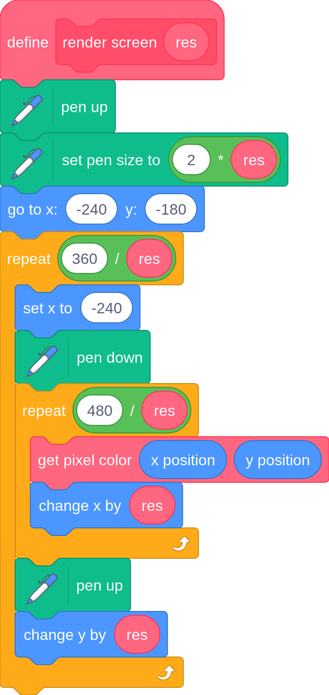

# Ray-based 3D rendering
*(BamBozzle, badatcode123)*  

Ray-based techniques in 3D graphics use rays. Rays are defined by their origin (a position in 3D space where the ray starts) and their direction (A vector parallel to the direction of the ray). There are many uses of rays in general, especially in 3D, but it is also possible to use them to fully view a 3D world by itself. This is done by determining if a ray collides with any objects. Methods for this include raytracing, raymarching and DDA. For each pixel in the screen, a ray is cast into the scene, and the pixel is then set to the appropriate color based on how it collides with the objects in the scene. To convert RGB to pen color, refer to the section about [Handling colors in Scratch](../handling-colors-in-scratch/handling-colors-in-scratch.md). Remember, do NOT turn on “run without screen refresh”.

For each pixel we need to perform a function to do ray collisions, but first we need to define the ray origin and ray direction. The ray origin for this case is the camera position, and the ray direction is defined as   
**`![][image28]`**  
The focal length is how far the lens of the camera is from the aperture, this is inversely proportional to FOV and should be around 300\. With the ray origin and direction defined, we can now use the ray algorithms to move the rays.

## 