# Ray-marching
*badatcode123, derpygamer2142, jfs22*  

Raymarching is a method of ray-based 3D rendering that steps rays through a scene in order to approximate collisions. Raymarching is unique however, in that it uses Signed Distance Functions, or SDFs, to step by the most it can without hitting an object. When inside an object, SDFs return negative, hence the signed part of the name.  

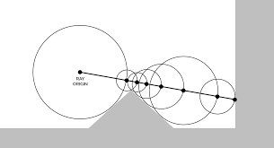

A ray is considered to be intersecting an object when the SDF is less than some arbitrarily small threshold, often called “epsilon”. Additionally, to stop infinite steps when a ray does not hit an object, a maximum number of steps and maximum SDF size are usually used. When these factors are exceeded, the loop is broken.  
SDFs tend to be far simpler than ray-surface intersection functions, for example, here is the SDF to a sphere, which is just the distance to the center minus the radius of the sphere:  

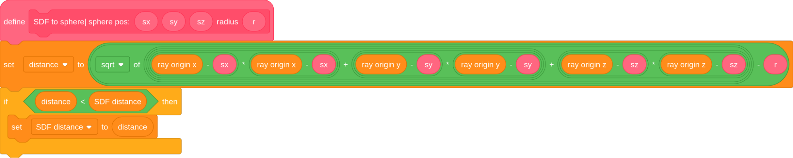

In each step of the ray, the following occurs;  
1\. The SDF is sampled at the current ray position  
2\. The ray is stepped forward  
3\. The factors used to abort the loop are checked  
After each SDF sample, the ray is stepped accordingly;  

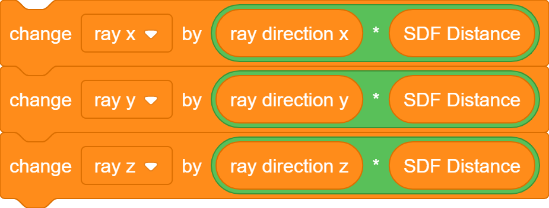

We can color each pixel based on what condition is met. In the below image, pixels that stopped because the nearest SDF was less than the epsilon are colored white, and pixels that either exceeded the maximum number of steps or exceeded the maximum SDF distance are colored black:  

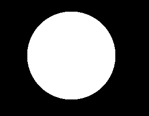

In this image, the sphere is at the position 0, 0, 50 with a radius of 15\. The focal length is 350\. This is pretty boring, so we can add [diffuse lighting](../shading/shading.md#diffuse-models) by instead setting the pixel’s color to the dot product of a light vector and the surface normal(we calculate that [here](#raymarched-normals)). Here’s the new image with a light vector(unnormalized) of 1, 1, \-1:  

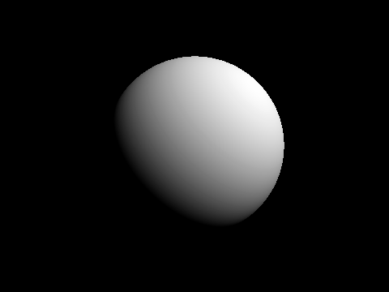

Next we can add a plane for one of the later articles, [shadows](#advanced-shadows):

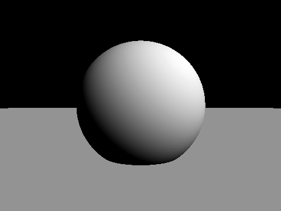

### Useful primitives

*derpygamer2142*  
A primitive is a basic function(in this case that returns distance) that can be used to construct more complex functions. You can find a full list of the functions that are being adapted at [https://iquilezles.org/articles/distfunctions/](https://iquilezles.org/articles/distfunctions/)

The arguments of this function are the point to find the distance to, the sphere’s position, and the sphere’s radius.  

### Advanced SDFs/SDEs

*jfs22*  

Starting with a simple primitive, SDFs can be modified in many ways. Some of these modifications include domain repetition and various domain warping. These work because as a ray steps though a scene, it can be moved and warped in order to create the effect of moved and warped geometry.

Stretching  
Simple stretching along a coordinate axis can be done with a division. Stretching the Y axis by 2 times would be written as Ray Y/2, so in a function with an input of Ray Y, it would instead by Ray Y/2. This technique applies to all axes.

Shearing  

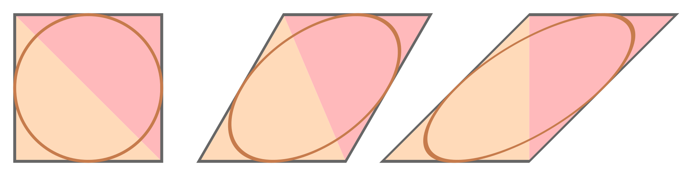

Domain repetition

Isolating repetition

Noise

Examples

### Raymarched Normals {#raymarched-normals}

*jfs22, 26243AJ*  

Raymarched Normals can be approximated with multiple SDF samples, or in specific scenarios, can be skipped by using the directional derivative method.

Solving the normal  
In raymarching, normals can be computed by sampling SDF values around a point. To see how this works, let’s first define a normal. Yes, normals are the direction of a surface, but what does this mean in terms of the SDF? We can see that moving the ray in the direction of the normal would increase the SDF by the greatest amount. Taking this logic, we can sample multiple points around the actual intersection point and see how the SDF changes, then create a vector which maximizes the SDF. In this diagram, you can see how samples pointing towards and away from the surface add to those components of the vector, and samples moving along the surface add less. By adding these up, you get an approximation of the normal.

In 3d, you can sample 6 points, one on each axis. This works, but is not optimal. Instead of sampling each axis, we can sample the 4 points of a tetrahedron. The code follows;  

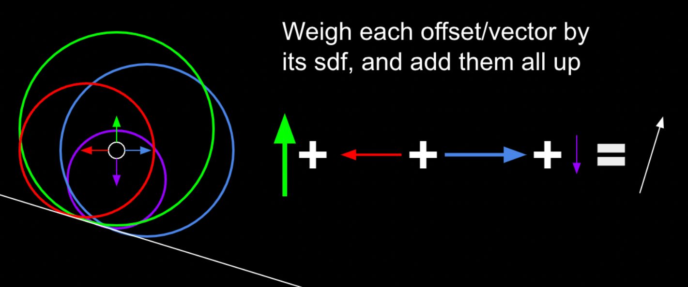

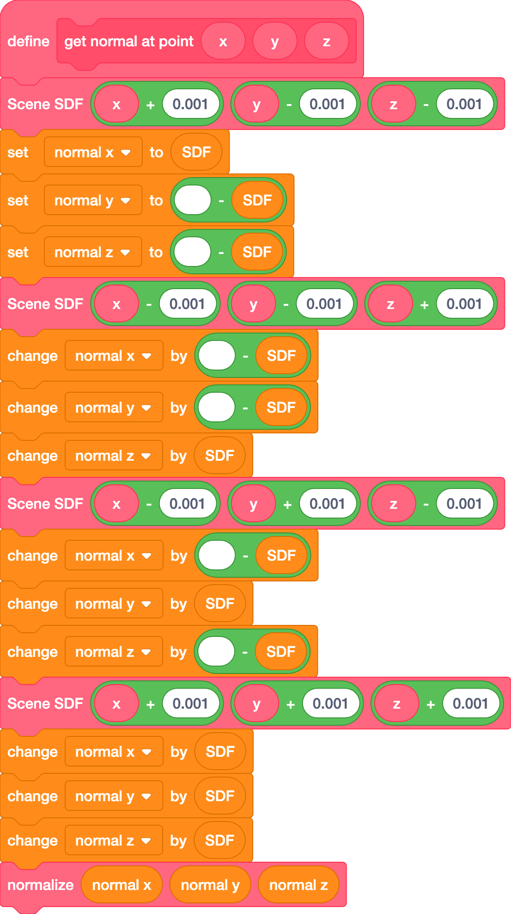

Directional derivatives

The directional derivative method utilizes the fact that for simple lighting (ie. dot product lighting), all that is needed is the similarity between the direction of the light and the surface normal. 

### Advanced shadows {#advanced-shadows}

*jfs22, derpygamer2142*  

Although not cheap, simple shadows can be done just by shooting a ray from the surface of an object towards any light. This checks for any obstructions between the light, allowing simple, hard shadows. If the point at the surface of the object is obscured, it is dark. If it isn’t, it’s bright. In code, it is a simple if statement checking if the ray has hit.

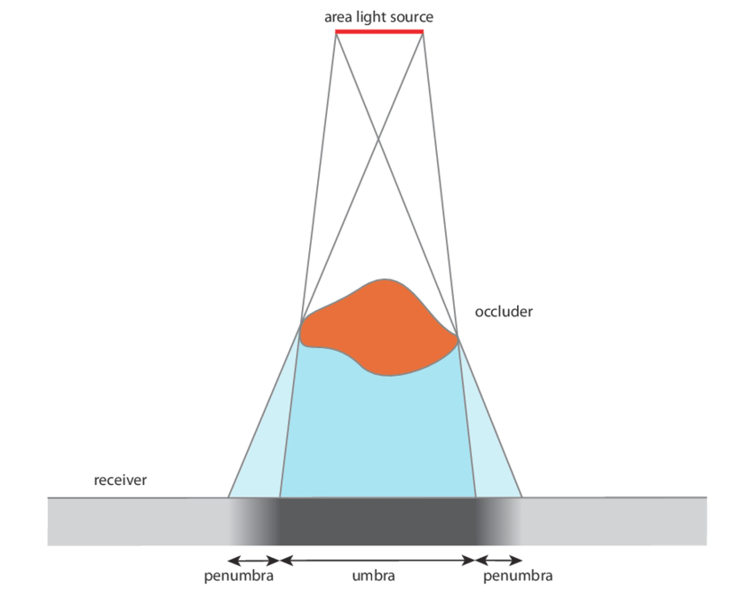

In reality, however, there is no particular line separating shadows, but instead a smooth transition between light and shadow. This gradient is called the penumbra, where not all of a light is illuminating an object. Although it’s impossible to calculate the penumbra in one ray, it can be approximated practically for free by storing the minimum of a simple division and multiplication. For each step of the shadow ray, (SDF/Distance of the ray)\*Sharpness constant is compared to the current minimum, and set if it is smaller. This works since near misses slowly transition from the SDF factor and the distance causes further points to fade out more, like in real life. In code, this is run every step of the ray, inside the “for loop” shown earlier;

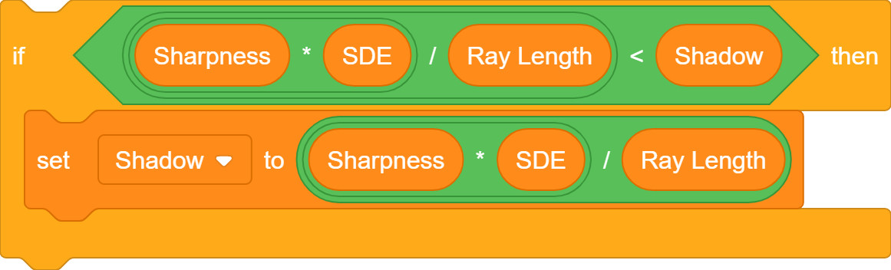

Once again, multiplying this lighting value by the color leaves a result similar to this:  

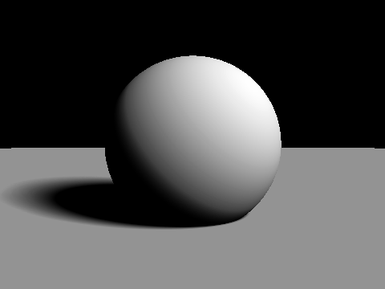

### Ambient occlusion
*jfs22*

Ambient occlusion is one of many techniques used to replicate path traced graphics. This simulates ambient light being occluded by surrounding elements, often seen in corners. Taking advantage of our distance estimates, we can sample points at varying distances in the normal direction, and compare the distance estimates. 

You can see how this works on the diagram on the right, where the yellow lines represent the distance estimates, and the pink lines represent the distance from the original point. In a perfectly flat section, the yellow distance is equal to the pink distance, but on occluded corners, you can see that the yellow distance is significantly less. We can model this by subtracting yellow from pink for each sample, adding them up, and multiplying by a value controlling the strength of the effect. You may notice however, that your ambient occlusion seems to be reversed. This is fixed simply by subtracting from one resulting in this:

Like above, k represents the strength of the ambient occlusion, while j represents how many samples you take. There is one last change to make, however. Using this model, far away samples contribute equally to the ambient value, which can leave unnatural results. You can optionally have further points contribute exponentially less to fix this, multiplying samples by smaller and smaller amounts as follows:

