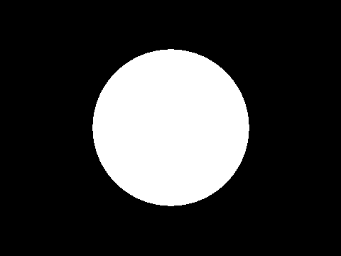

# Ray-tracing
*26243AJ, badatcode123*  

Raytracing is a method of 3D rendering that uses ray-surface intersection functions to find the nearest intersection distance to an object, “t”, if the ray hits the object. A simple ray-surface intersection is the ray-sphere intersection, shown below.  

```blocks
define Ray-sphere intersection|sphere pos (x) (y) (z) radius (rad) color (r) (g) (b)
    set [nx v] to ((ray origin x) - (x))
    set [ny v] to ((ray origin y) - (y))
    set [nz v] to ((ray origin z) - (z))
    set [b v] to ((((ray dir x) * (nx)) + ((ray dir y) * (ny))) + ((ray dir z) * (nz)))
    set [c v] to (((((nx) * (nx)) + ((ny) * (ny))) + ((nz) * (nz))) - ((rad) * (rad)))
    set [t v] to ((b) * (b) - (c))
    if <((t) > (0))> then
        set [t v] to (((0) - (b)) - ([sqrt v] of (t)))
        check if intersecting (t) object color (r) (g) (b) :: custom
    end
```

##
```blocks
define check if intersecting (t) object color (r) (g) (b)
    if <<(t) > (0)> and <(t) < (ray t)>> then
        set [ray t v] to (t)
        set [object color R v] to (r)
        set [object color G v] to (g)
        set [object color B v] to (b)
    end
```

Now we can test intersections with every object in the scene and then color that pixel the color of the object (reminder that the color of the object is from 0-1 not 0-255) that has the smallest t value or the background color if there are no intersections. Do the ray-sphere intersection right after defining the ray origin and direction.  



*Expected output (circle radius of 25 and positioned at 0,0,100)*
