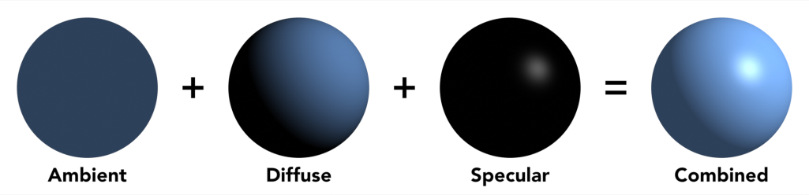

# Shading
*SpinningCube*
## Material {#material}

Diffuse objects are objects that reflect light completely randomly, meaning the outgoing and incoming directions have no relationship. This is often called lambertian reflectance.

Metals are objects that reflect light almost always in a specular way, meaning they often absorb transmissions.

Glasses usually refract light, but can also reflect light (more noticeable at steep angles, due to the fresnel effect).

## Diffuse models {#diffuse-models}

Many models, or BRDFs, exist for diffuse calculations, the most easiest and basic one is the lambertian diffuse model, it is defined simply as albedo/pi, with albedo being the reflectivity of the object. Other, more advanced models such as oren-nayar can represent diffuse objects more realistically at the cost of being more expensive to calculate and also needing many samples to converge because they use the microfact model.

## Specular models

### Combined

In graphics, it is common to combine both the specular and diffuse models, alongside the ambient value, for more realistic shading than just using one model, as seen below  

*By SpinningCube*

## Shadows

### Ray-based

Hard shadows can be achieved by shooting rays directly at the light sources from an object’s surface. If the ray is blocked by some object before reaching the light source, that point on the surface is in shadow.

Raymarching can make an approximation of soft shadows, explained in the raymarching section.

### Depth-buffer based

Another method of shadow casting is rendering the scene to a depth buffer from the light’s point of view. Then, when figuring out if a pixel is in shadow, we find where the pixel is in the depth buffer of each light, and if there’s a depth value smaller than the depth value of the current pixel, projected onto the depth buffer, then we can safely conclude that it’s in shadow. This method however, can be quite costly, because of the fact we need to render a depth buffer for each light source, plus to get a good shadow resolution, the resolution of each depth buffer has to be quite high. Keep in mind that for point lights, the fov of the theoretical camera on the light will be 360 degrees, which will add to the resolution of the depth buffer. Plus, rendering an image for each light is just not possible considering the limitations of scratch or turbowarp, unless the scene is very simple and there’s only a couple of lights.

### Rasterizer

\=\> talk about how to do shadows with rasterizers.

## Baked lighting

\=\> about baked lighting methods in Scratch (texture based like The Mast by awesome-llama, polygon-based like Sub 1k Block Challenge by littlebunny06)